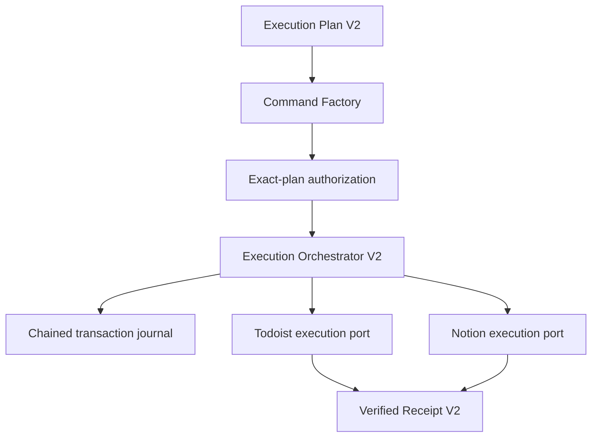
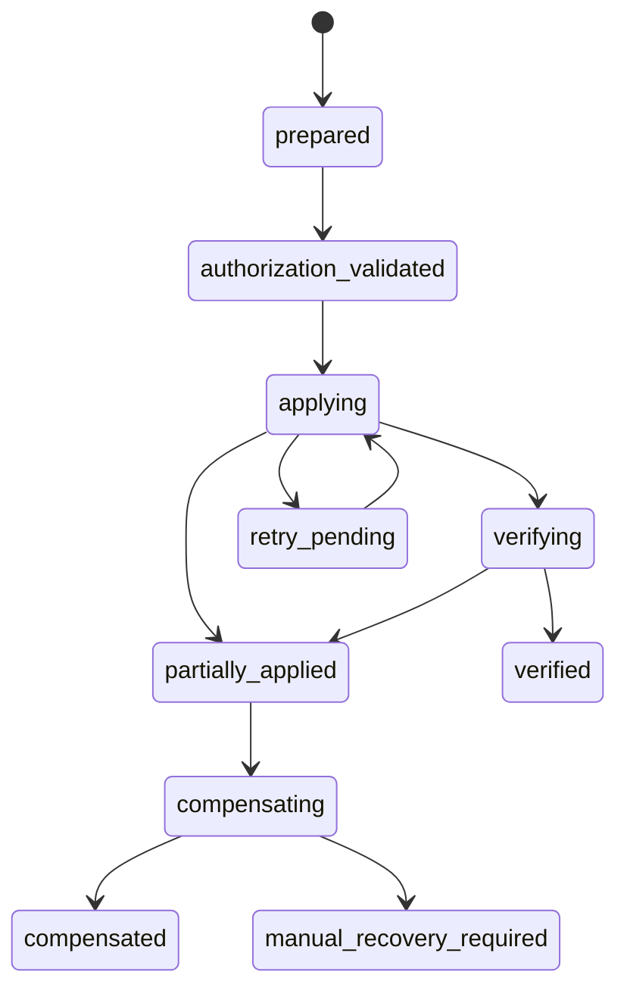

# ADR-008: Execution Orchestration and Provider Separation

Status: Accepted for the Atlas ROS v5.6.0 compatibility candidate.

## Context

The v5.5 Execution Planner decides whether execution work should exist and produces an immutable,
provider-neutral `ExecutionPlanV2`. The earlier orchestration foundation used an unbound Boolean
confirmation and a concrete Todoist dependency. That foundation preserved production behavior but
could not prove exact-plan authorization, deterministic recovery, multi-provider separation, or
tamper-evident transaction history.

## Decision

Atlas ROS adds additive V2 contracts and keeps all V1 readers:

- `ExecutionAuthorizationV2` binds Ryan's attended confirmation to the exact plan ID, plan digest,
  action, provider scope, operation types, maximum object count, replay policy, and correlation ID.
- `ExecutionCommandV2` contains only the ordered operations already justified by the plan.
- `ExecutionOrchestratorV2` validates authorization, owns legal state transitions, sequences narrow
  provider ports, governs retries and compensation, and emits the aggregate receipt.
- `TransactionJournalEntry` forms an append-only SHA-256 chain that excludes timestamps from its
  deterministic integrity payload and excludes secrets entirely.
- `TodoistExecutionAdapterV2` and `NotionExecutionAdapterV2` own provider rendering, schema and
  target resolution, provider operations, error mapping, and immediate readback.
- `ExecutionReceiptV2` rejects `applied=true` unless every requested operation completed, every
  required readback passed, and the final state is `verified`.
- W03 translates `confirmed=True` into a narrowly bounded V2 authorization for the exact legacy
  plan. W03 never creates provider operations itself and remains a compatibility facade.

## Transaction states

Illegal transitions fail closed. `verified` cannot be reached without adapter readback. A partial
transaction reports applied and unapplied operations. Compensation is attempted only for operations
whose exact command scope permits it; otherwise the transaction produces explicit recovery
instructions for Ryan.

## Retry and idempotency

Retries are bounded to three attempts, reuse the same operation idempotency key, and are available
only for transport, timeout, rate-limit, and provider 5xx classifications. An uncertain create is
read back before retry. Validation, authorization, schema, permission, readback, and unknown errors
are never retried automatically. No recurring or unattended retry schedule is introduced.

Command, transaction, provider-operation, Todoist parent/child, Notion record/link, and receipt
identities are deterministic and plan-digest-bound. A changed plan requires new authorization.

## Security

Contracts reject common credential fields. Live adapters remain opt-in through explicit provider
configuration; fake providers are the test default. Custom provider base URLs remain prohibited by
the existing adapter policy. Events contain IDs and digests, not task content, credentials, or raw
provider payloads.

## Compatibility and rollback

V1 contracts, W03, W03A, Objective and Done When headings, domain section routing, hierarchy,
link-writeback, provider readback, and W04 reconciliation remain available. This is an additive
compatibility release. Rollback to v5.5.0 remains executable because no V1 contract or historical
authority is removed.

## Consequences

The release adds deliberate state and contract complexity. In return, provider logic cannot decide
whether work exists, authorization is exact and auditable, retries cannot silently duplicate work,
partial failures are represented truthfully, and no successful receipt can precede readback.
